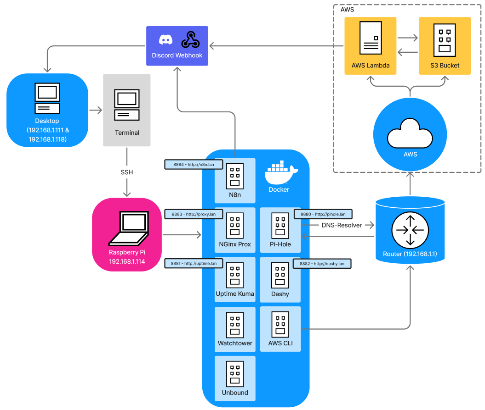

# Homelab – Pi-Hole All-In-One DNS NIDS

This project demonstrates the setup of my centralized, energy-efficient, and low-maintenance homelab infrastructure based on a **Raspberry Pi 4**.  
The goal was to combine multiple security and network services in isolated Docker containers, combined with AWS cloud integrations for automation and monitoring . 

---

## 🚀 Features
- **Pi-hole** – DNS filtering & ad blocking over the whole network  
- **Unbound** – independent DNS resolver  
- **NGINX Proxy Manager** – reverse proxy with SSL management  
- **Uptime Kuma** – service and availability monitoring  
- **Dashy** – personalized service dashboard  
- **Watchtower** – automatic container updates  
- **AWS CLI Integration** – log uploads & backups to S3  
- **AWS Lambda** – event-based DNS log analysis  
- **N8n** – workflow automation platform
- **Discord Webhook** – real-time alerts  

## 🛠️ Architecture
- **Hardware**: Raspberry Pi 4 (4GB RAM)  
- **Platform**: Docker containers for all services  
- **Network**: Router → Pi-hole/Unbound → local clients  
- **Cloud integration**:  
  - Logs uploaded hourly to AWS S3  
  - AWS Lambda analyzes logs against IoC feeds  
  - Matches trigger Discord alerts (webhook)

 

## 🔐 Security Use Cases
- DNS filtering against ads, trackers, and common malware domains  
- Automated IoC matching (Threat Intelligence feeds such as Abuse.ch, FeodoTracker, Ipsum)  
- Real-time security incident notifications (through RSS-Feeds such as FeedBurner, DarkReading, BleepingComputer & Krebsonsecurity)
- Secure container management and automated updates  

## 📈 Benefits
- Centralized management of network & monitoring services  
- Automated maintenance → reduced manual workload  
- Improved network security & visibility  
- Scalable and extensible to an extent (SIEM, honeypots, threat hunting...)  

## 📂 Tech Stack
- Raspberry Pi OS Lite 64-bit  
- Docker & Docker-Compose  
- Pi-hole, Unbound, Dashy, Uptime Kuma, Watchtower, NGINX Proxy Manager, n8n  
- AWS (S3, IAM, Lambda)  
- Python (AWS Lambda script) & Bash (AWS Upload)
- Discord Webhooks  

## Additional Information
- For a step-by-step setup guide, see the `docs/` directory. The full documentation is in German. Every configuration file is defined in the documentation and uploaded in the same directory.  
- This project was built purely for fun and learning purposes, using only free resources (e.g., AWS Free Tier).  
- Special thanks to various RSS feeds and IoC lists used for testing and validation.  